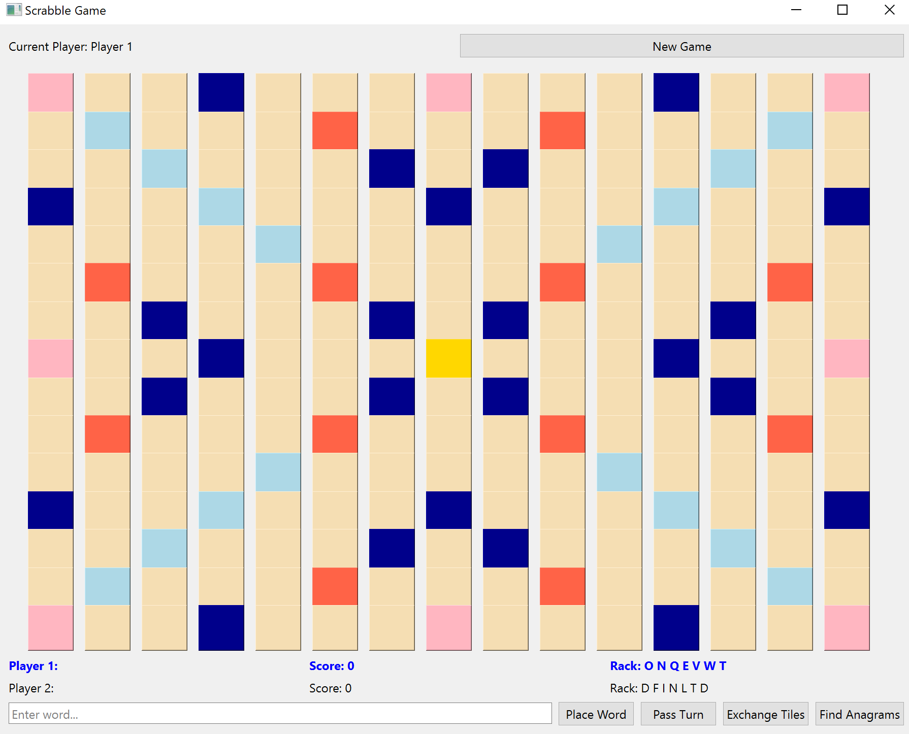

# Scrabble Game

## Описание проекта

Игра Scrabble — это классическая настольная игра, в которой игроки соревнуются в составлении слов на игровом поле 15×15 клеток. Цель игры — набрать максимальное количество очков, используя буквы с разной стоимостью и бонусные клетки.

## Скриншоты



## Функциональность

- **Поле 15×15** с бонусными клетками:
  - 💎 Голубые клетки — удвоение буквы
  - 🧿 Синие клетки — утроение буквы
  - 🌸 Розовые клетки — удвоение слова
  - 🍓 Красные клетки — утроение слова
  - ⭐ Жёлтая клетка — центр (стартовая позиция)

- **Игроки**: от 2 до 4 человек
- **Ход игры**:
  - Первое слово должно проходить через центральную клетку
  - Все последующие слова должны пересекаться с уже существующими буквами
  - Слова выкладываются только по горизонтали или вертикали

- **Подсчёт очков**:
  - Каждая буква имеет свою стоимость (A=1, Q=10, Z=10 и т.д.)
  - Бонусы за буквы и слова
  - +50 очков за использование всех 7 букв за ход

- **Дополнительные возможности**:
  - 🔄 Обмен фишек (считается как ход)
  - ⏭️ Пропуск хода
  - 🔍 Поиск анаграмм из букв игрока

## Технологии

- **Язык**: C++17
- **GUI**: Qt 6.11.0 (Widgets)
- **Сборка**: CMake 3.16+
- **Тесты**: Doctest
- **Документация**: Doxygen

## Установка и запуск

### Требования

- Qt 6.11.0 или новее
- CMake 3.16 или новее
- Компилятор с поддержкой C++17 (MinGW, MSVC, GCC)

### Сборка проекта

#### Вариант 1: Через Qt Creator

1. Открой Qt Creator
2. Выбери **Open Project** и выбери файл `CMakeLists.txt`
3. Выбери комплект сборки (Kit)
4. Нажми **Build** (молоток) или **Ctrl+B**
5. Нажми **Run** (зелёный треугольник) или **Ctrl+R**

#### Вариант 2: Через командную строку

```bash
# Клонируй репозиторий
git clone https://github.com/BochechkaAnastasia/Scrabble_game.git
cd ScrabbleGame

# Создай папку для сборки
mkdir build
cd build

# Настрой CMake
cmake ..

# Собери проект
cmake --build . --config Release

# Запусти игру
./ScrabbleGame.exe
